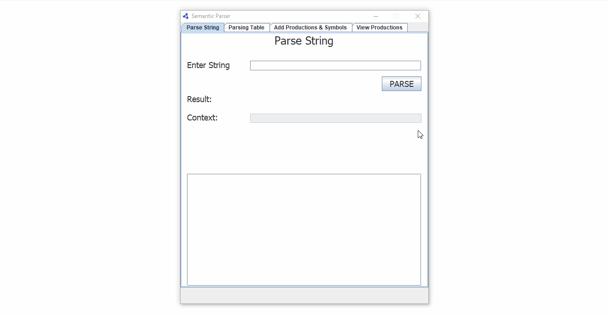

# Semantic-Parser
Semantic Parser based on LR parsing technique, extracts context/meaning of a given string. Extendible parser with database connectivity, users can add their own productions and corresponding contex. Developed in java, using java swing and JDBC for database connectivity.

### Requirements:
- JDK to run Compiled jar file.
- Java IDE (Neatbeans,etc for compiling source code)

### DEMO:

